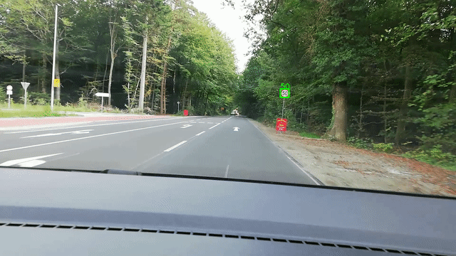
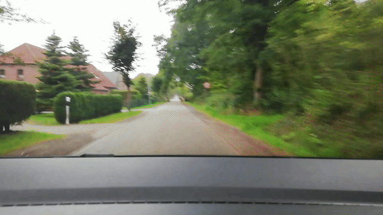

# Traffic sign recognition

Very simple traffic sign (actually only for velocity limitiation signs) recognition program. 

Used to test Machine learning capabilities after taking some online courses. 

Originally developed in 2019. 

## Data
The data was collected by attaching a smartphone to my car and recording videos. That is the reason, why I am not able to publish the dataset (as far as I know). The videos were converted to frames, and for each frame possible circles were cropped (using Hough transform). The cropped images (roughly 30,000) were labelled by hand. Today I know, that not that many manual labels were required, but it was a useful experience to value labelled data. 

To see some examples of the data, see [this notebook](notebooks/model_training.ipynb).

## Approach
The approach is rather simple. Each frame is first converted to gray-scale, cropped and blurred with a gaussian filter to filter out high-frequency noise. The resulting image is then processed with a Canny edge detector and a Hough transformation to detect circles. 
Around each circle center a 80x80 pixel large region is cropped (and padded if neccessary). On this cropped image a mask is added, with a circular shape and the radius obtained by the Hough transformation. 
This masked image is then feed into a convolutional neural network to classify it. The categories include all different sign categories and one 'other' category, containing cropped images that do not contain any traffic sign. 

## Performance
The performance is quite good. The classification is on a level comparable to MNIST. The other techniques like Canny edge detection and Hough transformation are well-known and easy to parametrize iteratively.

### Example 1

### Example 2

### Classification performance
Even a simple CNN model leads to accuracy rates of 95+%, a more advanced version can achieve 97.5% easily on unseen data. This is good enough for this approach, since a simple weighted average of the predictions is enough to filter out misclassifications. The models and training output can be found in this repository.

### Runtime
On a usual laptop the program runs at an acceptable frame rate of 5 - 20 fps, which would allow real-time usage, since traffic signs are in the frames for 0.5 to 2 seconds. The runtime could be significantly decreased, by reducing the input resolution to the Hough transformation or further improvements of the parameters. 

## Overview
### Notebooks
1. [Parameter estimation](notebooks/Parameter_estimation.ipynb): Estimation of the parameters for the Canny edge detector and the Hough transformation. The parameters can be estimated in an interactive way, by changing the parameters and observing the results. The parameters are saved to the `config.json` file.
2. [Model training](notebooks/model_training.ipynb): Training of the CNN models. First the data is loaded, then a simple CNN model is trained and evaluated. Afterwards a more advanced model is trained and evaluated. The models are saved to the `models` folder.

### Program
The program is located in the `src` folder. It is a simple python script, that can be run with `python src/end2end.py`. The program can be configured with some variables at the top of the file and the config file `config.json`. The program can be run in two modes:
1. **Live video**: The program reads a directory of images and shows a video in real-time speed with the detected traffic signs and the classification results. 
2. **Video output**: The program reads a directory of images and creates a video with the detected traffic signs.

## Conclusion
The approach is simple and works well, even in real-time.
The program can be used to detect traffic signs in a video stream and could be implemented on a smartphone to detect traffic signs in real-time.
I learned a lot about machine learning and computer vision during this project, and I am happy with the results.

Feel free to use the code for your own projects. If you have any questions, feel free to contact me.